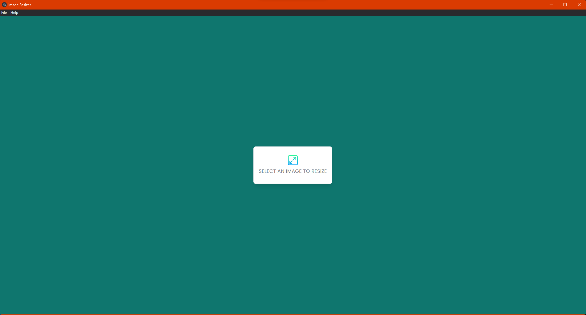
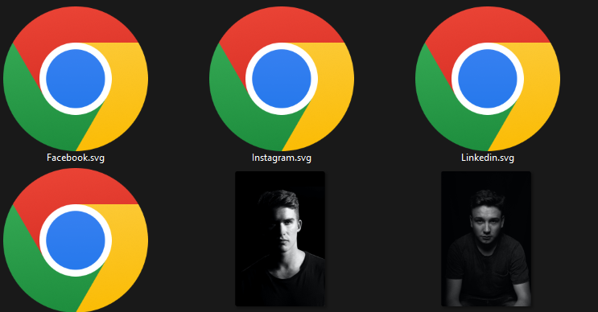
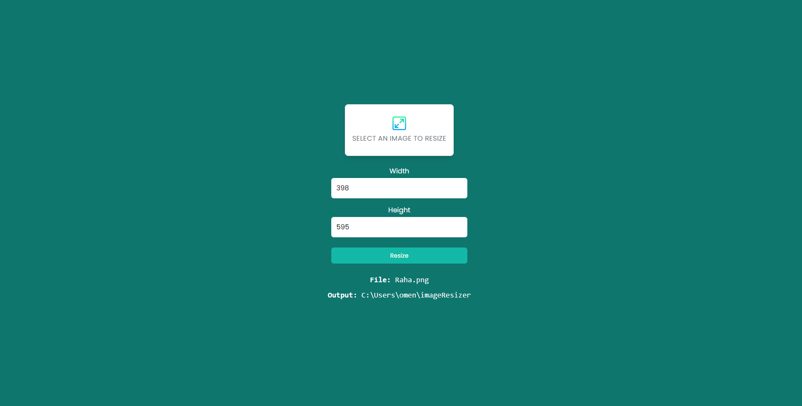
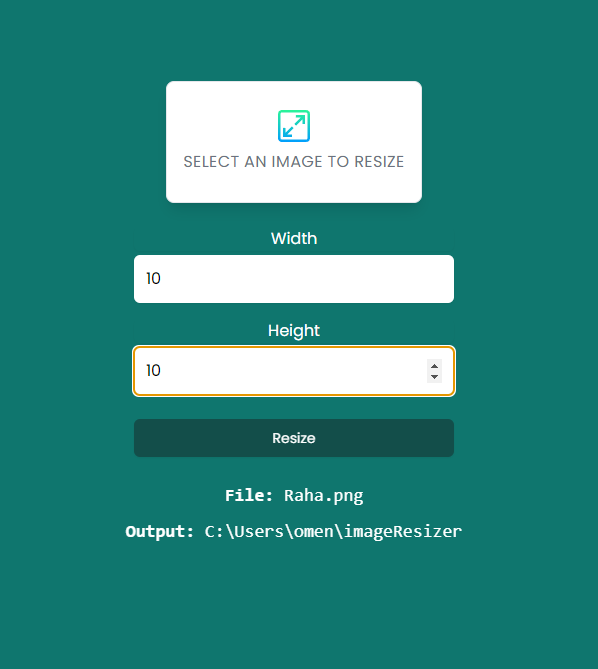
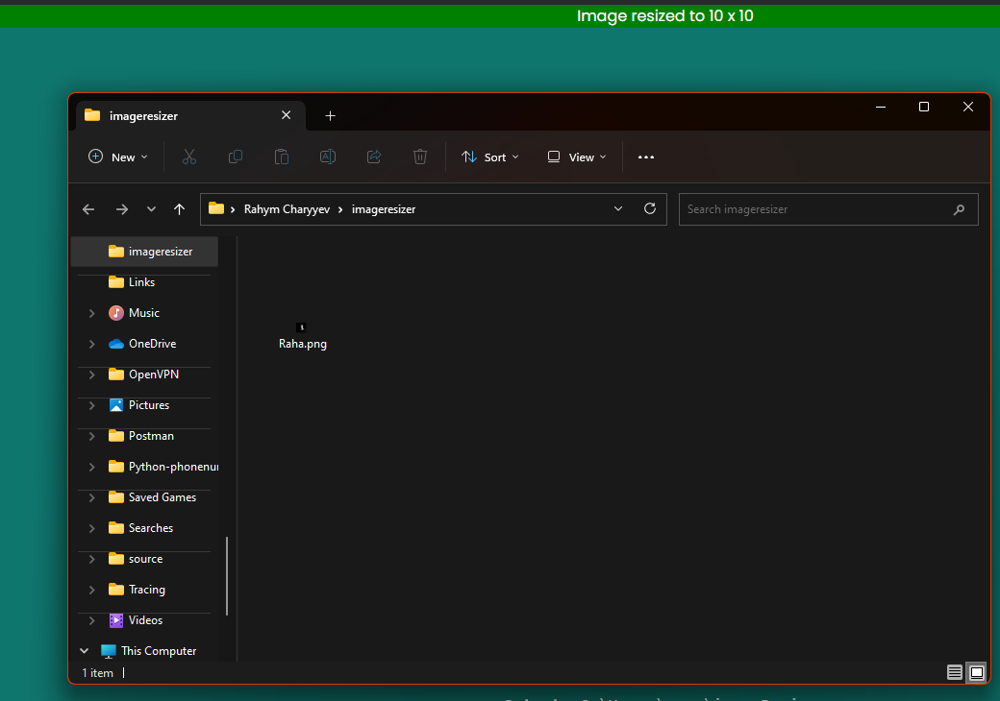

<h1 align="center" id="top">Image Resizer</h1>

<p align="center">
  

  

  

  <!--  -->

  <!--  -->

  

  
</p>

<!-- Status -->

<!-- <h4 align="center">
	🚧  Image Resizer Electron 🚀 Under construction...  🚧
</h4>

<hr> -->

<p align="center">
  <a href="#dart-about">About</a> &#xa0; | &#xa0; 
  <a href="#sparkles-features">Features</a> &#xa0; | &#xa0;
  <a href="#rocket-technologies">Technologies</a> &#xa0; | &#xa0;
  <a href="#white_check_mark-requirements">Requirements</a> &#xa0; | &#xa0;
  <a href="#checkered_flag-starting">Starting</a> &#xa0; | &#xa0;
  <a href="#memo-screenshots">Screenshots</a> &#xa0; | &#xa0;
  <a href="#memo-contact">Contacts</a> 
</p>

<br>

## :dart: About

The project of an app that created with Electron.js library to resize the image dimensions.

## :sparkles: Features

:heavy_check_mark: Image Information Display: Show relevant information about the selected image, such as file size, dimensions, and file format. This can assist users in making informed decisions while resizing.\
:heavy_check_mark: Custom Output Folder: Enable users to specify a custom output folder for the resized images. This gives users more control over organizing and managing their resized images.\
:heavy_check_mark: Auto-Naming for Resized Images: Automatically generate a new name for the resized image to avoid overwriting the original image and simplify file management.;

## :rocket: Technologies

The following tools were used in this project:

- [HTML](https://developer.mozilla.org/ru/docs/Web/HTML)
- [CSS](https://developer.mozilla.org/ru/docs/Web/CSS/Reference)
- [JavaScript](https://developer.mozilla.org/en-US/docs/Web/JavaScript)
- [Electron.js](https://www.electronjs.org/)
- [Resize-img](https://github.com/kevva/resize-img/)
- [Toastify.js](https://apvarun.github.io/toastify-js/)

## :white_check_mark: Requirements

Before starting :checkered_flag:, you need to have [Git](https://git-scm.com) and [Node](https://nodejs.org/en/) installed.

## :checkered_flag: Starting

```bash
# Clone this project
$ git clone https://github.com/RahymCharyyev/image-resizer-electron

# Access
$ cd image-resizer-electron

# Install dependencies
$ npm install

# Run the project
$ electron-forge start

# Make the installer file to use in PC
$ electron-forge make

```

## :memo: Screenshots

 \
&#xa0;
 \
&#xa0;
 \
&#xa0;
 \
&#xa0;
\
&#xa0;

## :memo: Contact

For any inquiries or questions, please contact <a href="https://github.com/RahymCharyyev" target="_blank">Rahym Charyyev</a>

&#xa0;

<a href="#top">Back to top</a>
